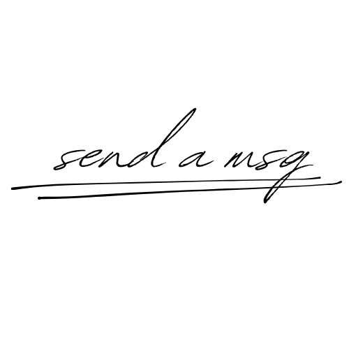

## About SendAMsg

Just another way to express your untold messages. Messages might not be received, but does it even matter?

## License

sendamsg is an open-sourced software licensed under the [MIT license](https://opensource.org/licenses/MIT).
